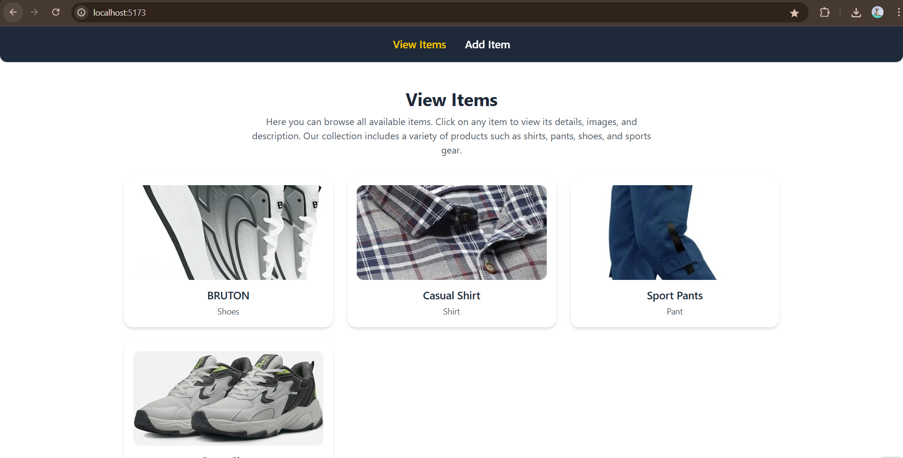

# Item Management MERN Stack Project

## Overview
This project is a full-stack application built using the **MERN Stack** (MongoDB, Express.js, React, Node.js). It allows users to:

- **Add Items** with cover images and additional images.
- **View Items** in a clean, user-friendly layout.
- **Enquire about Items** via an email form.

## Features
- ✅ Upload images to **Cloudinary** for reliable storage (from the **frontend**).
- ✅ REST APIs for creating and fetching items.
- ✅ Responsive frontend developed with **React** and **TailwindCSS**.
- ✅ Email notifications via **Nodemailer** (only configured on the **backend**).

## Technologies
- **Backend**: Node.js, Express.js, Nodemailer
- **Database**: MongoDB / Mongoose
- **Frontend**: React, TailwindCSS, Axios, Cloudinary

## Getting Started

### Prerequisites
- Node.js (v16+) and npm
- MongoDB
- Cloudinary Account
- Gmail Account and App Password

### Install Dependencies
```bash
npm install


### Environment Variables

**Backend (.env):**

MONGO_URI=<your-mongodb-uri> 
PORT=5000
EMAIL_USER=<your-email@example.com>
EMAIL_PASS=<your-app-password>
```

🔐 How to Generate EMAIL_PASS (Gmail App Password)

If you are using Gmail, you cannot use your regular Gmail password for sending emails via Nodemailer. Instead, you must create an App Password:

✅ Enable 2‑Step Verification for your Google account (if not already enabled).  
🌐 Go to your [Google App Passwords](https://myaccount.google.com/apppasswords) page.  
🗂️ Under Select app, choose Mail.  
🖊️ Under Select device, choose Other (Custom) and name it (e.g., Item App).  
🔑 Click **Generate** and copy the 16‑character password.  
📋 Use this generated password as your `EMAIL_PASS` in the `.env` file.
```

**Frontend (.env):**

```
VITE_CLOUD_NAME=dtliktnul
VITE_CLOUD_PRESET=amrr_items_preset
```

### Run the App

```bash
npm run server  # Starts the backend
npm run client  # Starts the frontend
```

## Endpoints

* `GET /items` – Get all items.
* `POST /items` – Add an item.
* `POST /items/enquire` – Send an enquiry email.

## Usage

* View available items.
* Click "Add Item" to fill in the form and upload images.
* Click an item in the listing to view its details.
* Make an enquiry via email for a specific item.


